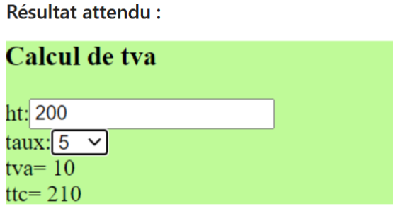

## TP "Calcul de TVA avec listes déroulantes"
### Consignes du TP

Coder de A à Z le composant src/app/basic/tva

- Calculer, via l'appel d'une seule fonction, les montants tva et ttc à partir d'un montant ht saisi et d'un taux de TVA séléctionné
- Permettre la sélection du taux de TVA (5, 10 ou 20) à travers une liste déroulante
- Après une première version temporaire où le déclenchement du calcul sera effectué via un bouton poussoir, coder une version améliorée (sans bouton) où la méthode qui réactualise les valeurs tva et ttc à calculer sera déclenchée via les traitements d'événéments suivants :
    - (input)="..." sur la zone de saisie du montant ht
    - (change)="..." lors du changement de sélection du taux

Votre mise en page devra être plus belle que celle proposée !

## Exercice Bonus : 

Ajouter, dans le component couleur, la possibilité d'ajouter de nouvelles couleurs à la liste des couleurs proposées.
Attention : il faudra bien vérifier que la couleur proposée par l'utilisateur est une couleur acceptée dans le css.